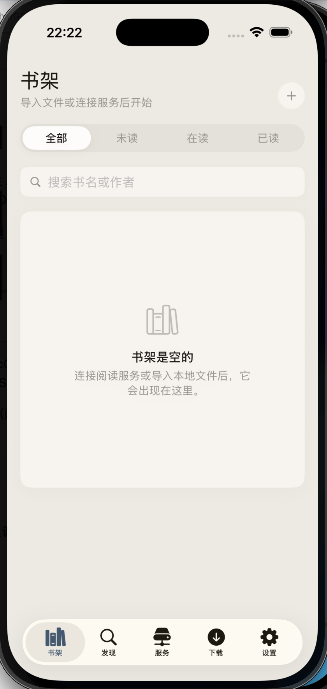
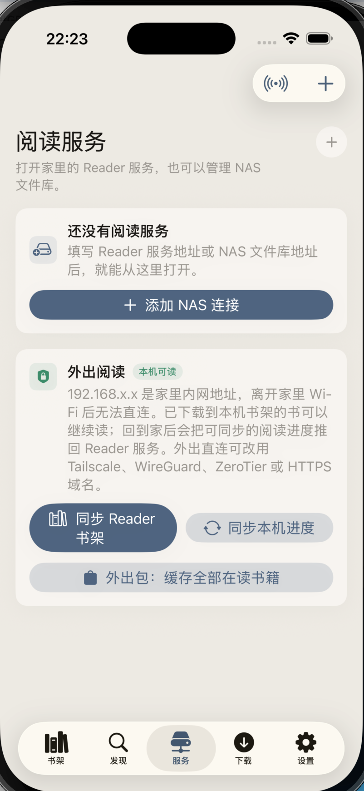
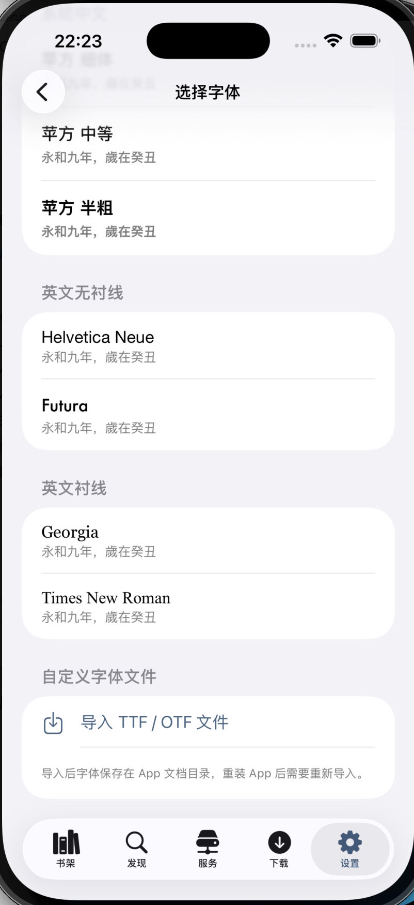

# 元阅 MetaRead

<p align="center">
  
</p>

<p align="center">
  <b>一款原生 Apple 平台小说阅读器</b><br/>
  支持 iOS · iPadOS · macOS
</p>

<p align="center">
  <a href="#功能特性">功能特性</a> •
  <a href="#截图">截图</a> •
  <a href="#安装与运行">安装与运行</a> •
  <a href="#致谢">致谢</a> •
  <a href="#许可证">许可证</a>
</p>

<p align="center">
  <a href="./README_EN.md">English</a>
</p>

---

## 简介

**元阅（MetaRead）** 是一款面向 iOS、iPadOS、macOS 的私人小说阅读器。可连接家中的 [阅读（Legado）](https://github.com/hectorqin/reader) 服务器同步书架，也支持本地 TXT/EPUB 导入、WebDAV NAS 浏览、可配置书源搜索等功能。

本项目的服务端接口协议借鉴了 **[hectorqin/reader](https://github.com/hectorqin/reader)**（阅读3 服务器版），在此特别感谢该项目及其社区的贡献。

## 功能特性

### 阅读体验
- 沉浸式阅读界面，支持字号、行距、段距、加粗调节
- 多种主题配色（浅色 / 深色 / 护眼暖色）
- 章节目录快速跳转
- iPad/macOS 宽屏双页阅读模式
- macOS 可自由调整窗口大小

### 书架管理
- 连接 [阅读（Legado）服务器](https://github.com/hectorqin/reader) 自动同步书架
- 首次启动引导配置服务器地址
- 本地 TXT 文件导入与智能章节拆分
- EPUB 基础解析（OPF spine、nav/NCX 目录、封面提取）
- 书籍格式/状态标签、阅读进度追踪

### 书源与发现
- 可配置书源规则，支持 CSS 选择器、XPath、JSONPath
- 兼容 Legado 书源 JSON 格式导入
- JavaScriptCore 脚本引擎支持
- 在线搜索与加入书架

### NAS 与下载
- WebDAV 协议浏览 NAS 文件
- Bonjour/mDNS 局域网自动发现
- 后台下载队列，支持 App 重启恢复
- 章节级缓存管理，支持离线阅读

### 数据与同步
- SQLite 本地持久化 + FTS 全文搜索
- 书库备份与恢复
- NAS 密码 Keychain 安全存储
- CloudKit 阅读状态同步（骨架）

## 截图

<p align="center">
  
  
  
</p>

## 安装与运行

### 环境要求

- Xcode 15+
- iOS 17+ / macOS 14+
- Swift 5.9+

### 编译运行

```bash
# 克隆仓库
git clone https://github.com/hankdab/MetaRead.git
cd MetaRead

# 命令行编译
swift build

# 或打开 Xcode 工程
open NovelReader.xcodeproj
```

### 连接阅读服务器

1. 部署 [阅读服务器（reader）](https://github.com/hectorqin/reader)
2. 打开元阅 App，按引导填写服务器 IP 和端口
3. 书架将自动同步

## 项目结构

```
Sources/NovelReaderApp
├── App/          # 应用入口、根视图
├── Core/         # 数据模型、AppStore、服务引擎
├── Views/        # UI 视图
│   ├── Discover/   # 发现页
│   ├── Downloads/  # 下载管理
│   ├── NAS/        # NAS 文件浏览
│   ├── Reader/     # 阅读器
│   ├── Settings/   # 设置
│   ├── Shared/     # 共享组件
│   └── Shelf/      # 书架
└── Resources/    # 资源文件
```

## 致谢

- **[hectorqin/reader](https://github.com/hectorqin/reader)** — 阅读3 服务器版，本项目的服务端接口协议借鉴于此
- **[gedoor/legado](https://github.com/gedoor/legado)** — 阅读3 Android 客户端，书源规则格式的原始来源

## 许可证

本项目基于 [MIT License](./LICENSE) 开源。
