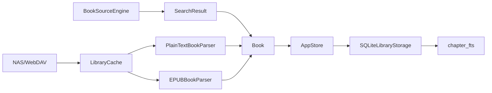

# 技术架构

## 产品定位

元阅是一个 Apple 平台原生小说阅读器，核心路径是：

1. 从 NAS、本地文件或书源获得书籍。
2. 进入统一书架。
3. 阅读器提供稳定排版、进度记录和离线体验。
4. 书源、替换净化、下载和同步能力围绕书架工作。

## 技术选型

| 模块 | 当前实现 | 目标实现 |
| --- | --- | --- |
| UI | SwiftUI | SwiftUI + 多窗口 + iPad/macOS 分栏优化 |
| 状态 | `AppStore` | 按域拆分 Store/ViewModel |
| 持久化 | SQLite 快照存储 | 关系表 + FTS 全文索引 |
| NAS | WebDAV XML 浏览/缓存 + Bonjour 发现 | WebDAV + SMB + SFTP |
| 书源 | 基础 CSS selector 搜索/下载 | CSS/XPath/JSONPath + JavaScriptCore |
| 阅读器 | TXT/EPUB 章节阅读 + 样式面板 + 宽屏双页 | 翻页/滚动/分页模式 |
| 下载 | 任务模型 + 后台处理器骨架 | URLSession background + 失败重试 |
| 同步 | 本地 | CloudKit 同步书架元数据与进度 |

## 模块边界

- `Core/Models.swift`：业务实体，不依赖 UI。
- `Core/AppStore.swift`：当前聚合状态中心，负责协调存储、书源、NAS。
- `Core/Services.swift`：外部服务边界，包括 WebDAV 与书源引擎。
- `Core/Parsers.swift`：TXT 章节识别与正文净化。
- `Views/*`：纯 SwiftUI 界面。

## 当前数据流



## 书源规则

规则模型借鉴 Legado 的概念，但不复制代码或协议绑定：

- 搜索页：`searchPath`、`resultListSelector`
- 结果项：标题、作者、书籍 URL
- 目录页：章节列表、章节标题、章节 URL
- 正文页：正文 selector
- 净化：普通替换或正则替换

当前 `SimpleHTMLExtractor` 支持基础 `.class`、`#id`、`tag`、轻量 XPath、JSONPath 和 Legado 链式选择器。未来可将解析后端继续扩展到 JavaScriptCore，用于执行更复杂的动态书源。

书源加入书架时会优先抓取目录，生成 `DownloadKind.chapter` 任务；后台下载完成后使用该书源的 `contentSelector` 和替换净化规则解析正文，并写回对应章节。

当前规则执行能力：

- CSS：`.class`、`#id`、`tag`、`@text`、`@href`、`@html`
- Legado 链式选择：如 `@a.0@text`、`@a.1@title`
- JSONPath 选择：如 `$.data.list[*]`、`$.data.list[0].title`、`$..title`、`$['data']['list'][1]`、`[?(@.author=='作者')]`
- XPath 轻量选择：如 `//*[@id='content']/text()`、`//a[@id='book']/@href`、`//*[contains(@class,'result')]`
- 模板变量：`{{keyword}}`、`{{key}}`、`{{searchKey}}`、`{{keywordRaw}}`、`{{page}}`
- 请求配置：支持 `url,{"method":"POST","body":"...","headers":"{...}"}` 或 `headers` 对象形式

### Legado 适配

`LegadoSourceAdapter` 支持导入单个或数组形式的 Legado 书源 JSON，并映射常见字段：

- `bookSourceName` -> `BookSource.name`
- `bookSourceUrl` -> `BookSource.baseURL`
- `searchUrl` -> `SourceRule.searchPath`
- `ruleSearch.bookList/name/author/bookUrl`
- `ruleToc.chapterList/chapterName/chapterUrl`
- `ruleContent.content/sourceRegex`

当前属于基础适配：常见 XPath、JSONPath、POST body/header 和模板变量已可执行；复杂 `<js>`、分页表达式和多步骤动态规则会保留为规则字符串，仍需要后续规则引擎继续增强。

## EPUB

当前 EPUB 解析器不依赖第三方包，包含一个最小 ZIP 读取器，可以读取：

- `META-INF/container.xml`
- OPF manifest/spine
- XHTML 章节正文
- nav.xhtml 或 toc.ncx 的章节标题
- cover-image 资源存在性

后续应补复杂层级目录和更完整的压缩格式兼容。封面图片已经会从 manifest 中定位、解包到本地 Covers 缓存，并在书架卡片中优先显示真实封面。

## NAS 策略

第一优先级是 WebDAV，因为 iOS/iPadOS/macOS 都容易部署，群晖、威联通、TrueNAS 和很多轻量 NAS 都支持。

`NASConnection` 已包含 `username` 和运行时 `password`，WebDAV 请求会自动加入 Basic Auth。密码由 `KeychainNASCredentialStore` 保存，`NASConnection` 编码到 SQLite 快照或备份 JSON 时会省略 `password` 字段。读取旧快照或旧备份时，如果里面曾经带有密码，会迁移进 Keychain，下一次保存后明文密码会从快照中消失。

401 会映射为“账号或密码不正确”，403 会映射为“权限不足”；这两类认证错误不会显示预览目录，避免把失败连接误认为真实 NAS 内容。

SMB 和 SFTP 放在第二阶段，建议通过单独适配器隔离。侧载版可以接入原生库，但当前代码不会把 SMB/SFTP 假装成已支持；遇到这两类协议会给出“需要接入对应客户端库”的明确提示。

```swift
protocol NASClient {
    func listDirectory(connection: NASConnection, path: URL) async throws -> [NASItem]
    func download(item: NASItem) async throws -> URL
}
```

## App Store 风险

项目应该声明“不提供内容”，用户自行配置 NAS 与书源。CloudKit 只同步书架元数据、阅读进度和设置，不主动同步受版权保护的书籍正文。
